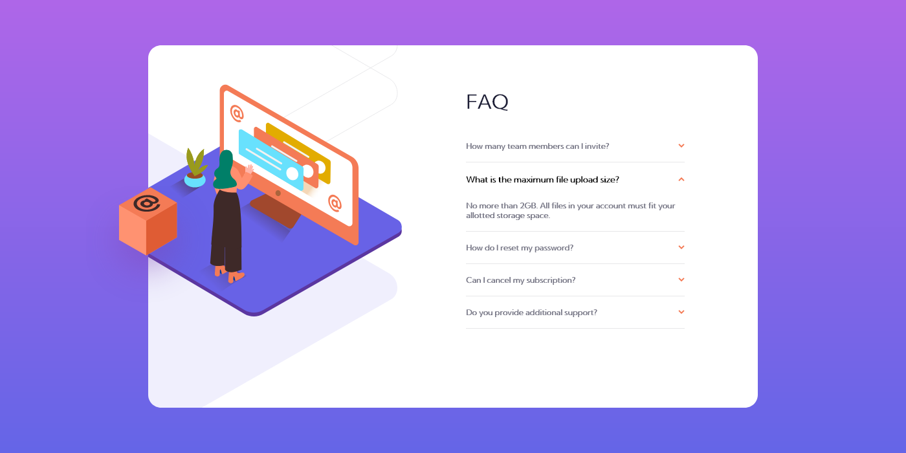
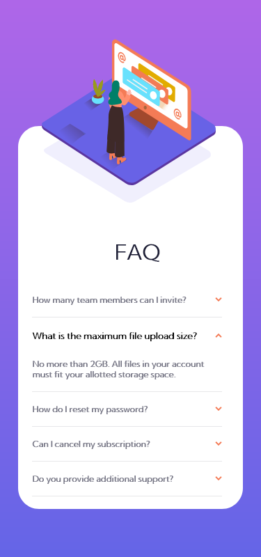

# FAQ-card-Frontend-Mentor-Challenge
A frequently asked question section card

This is a solution to the [FAQ accordion card challenge on Frontend Mentor](https://www.frontendmentor.io/challenges/faq-accordion-card-XlyjD0Oam). Frontend Mentor challenges help you improve your coding skills by building realistic projects. 

## Table of contents

- [Overview](#overview)
  - [The challenge](#the-challenge)
  - [Screenshot](#screenshot)
  - [Links](#links)
- [My process](#my-process)
  - [Built with](#built-with)
  - [What I learned](#what-i-learned)
  - [Useful resources](#useful-resources)
- [Author](#author)

## Overview

### The challenge

Users should be able to:

- View the optimal layout for the component depending on their device's screen size
- See hover states for all interactive elements on the page
- Hide/Show the answer to a question when the question is clicked

### Screenshot




### Links

- Solution URL: [https://Vicktuur/FAQ-card-Frontend-Mentor-Challenge](https://Vicktuur/FAQ-card-Frontend-Mentor-Challenge)
- Live Site URL: [vicktuur-faq.com](https://vicktuur-faq.netlify.app)

## My process

### Built with

- Semantic HTML5 markup
- CSS custom properties
- CSS Grid
- Desktop-first workflow

### What I learned

I learned about background images and positioning with the appropraiate responsive widths. As shown in the example below 👇
```css
.image { 
        padding-top: 0px;
        margin-left: 0px;
        background: url(images/bg-pattern-mobile.svg);
        background-repeat: no-repeat; 
        background-position: 45% 10%;
        padding-bottom: 50%;
        background-size: 80%;
    }
```
I also learnt to hide and show sections with just a few lines of javascript as illustrated below 👇
```js
const faqs = document.querySelectorAll(".faq");
        faqs.forEach((faq) => {
            faq.addEventListener("click", () => {
                faq.classList.toggle("active");
            });
        });
```

### Useful resources

During the course of this project, I found this platform very much helpful 
- [w3schools](https://www.w3schools.com) - It helped me in having thorough understanding of background images and  image positioning and size proportion.

## Author

- Linkedin - [@Abiye-Iniabere](https://www.linkedin.com/in/abiye-iniabere-6715391b3)
- Frontend Mentor - [@Vicktuur](https://www.frontendmentor.io/profile/Vicktuur)
- Twitter - [@Victor_Abiye](https://www.twitter.com/Victor_Abiye)
